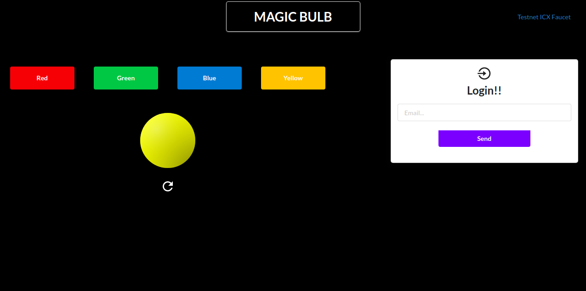
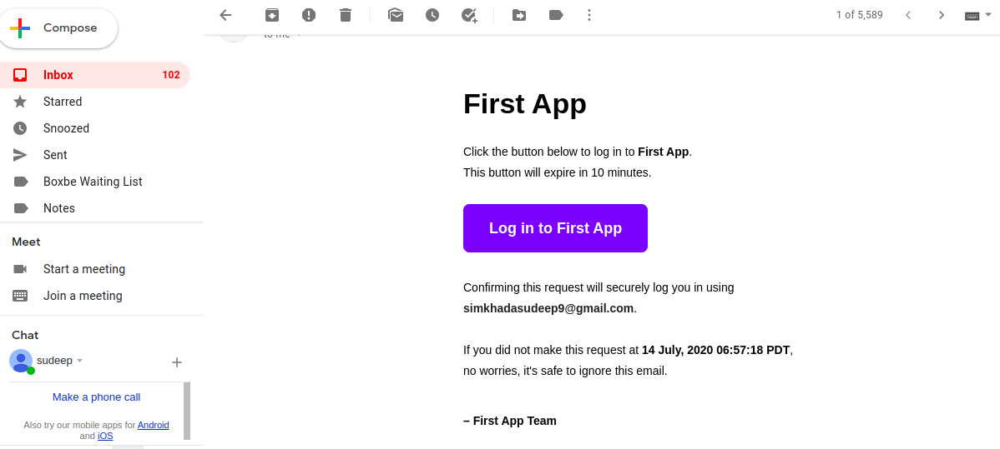
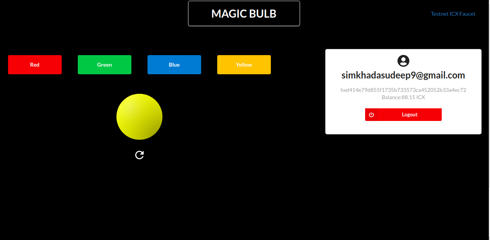

# Magic

## What is Magic?

**Magic** is a developer SDK which you can integrate into your application to enable **passwordless** authentication using **magic links**.

Magic enables the authentication process through following steps:
- User login with their email address and a **magic link** is sent to the address through use of Magic SDK.

- User clicks on that link for authenticating to the application.

- Successful login message is shown up and user is securely logged in.


If it's a web application, users are logged into the original tab, even if the user clicked on the magic link on a different browser or mobile device!


Thus with Magic SDK, you can enable blazing-fast, hardware-secured, passwordless login with a few lines of code. It is also plug-n-playable even if you already have an existing auth solution!

