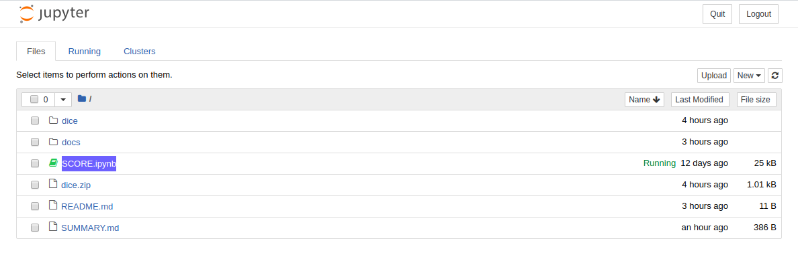

# SCORE Interaction
Let us now go to our main motive i.e use of Jupyter Notebook for interacting with the Dice SCORE. Before proceeding ahead make sure the [**prerequisites**](prerequisites.md) are already installed.

## Cloning the project repo

You can get the project repo from [**Github**](https://github.com/kailehok/opendevicon)


Run command
```py
$ git clone https://github.com/kailehok/opendevicon.git
```
Open Jupyter Notebook file using command
```py
$ cd opendevicon
$ jupyter-notebook
```
Now you can see a Jupyter instance running in your browser


Click on [**SCORE.ipnyb**] file which will be our main Jupyter Notebook file
