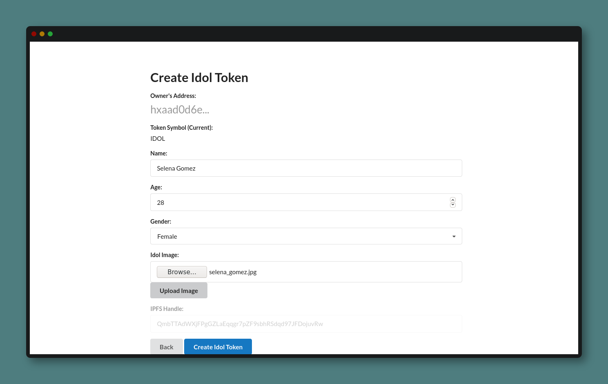
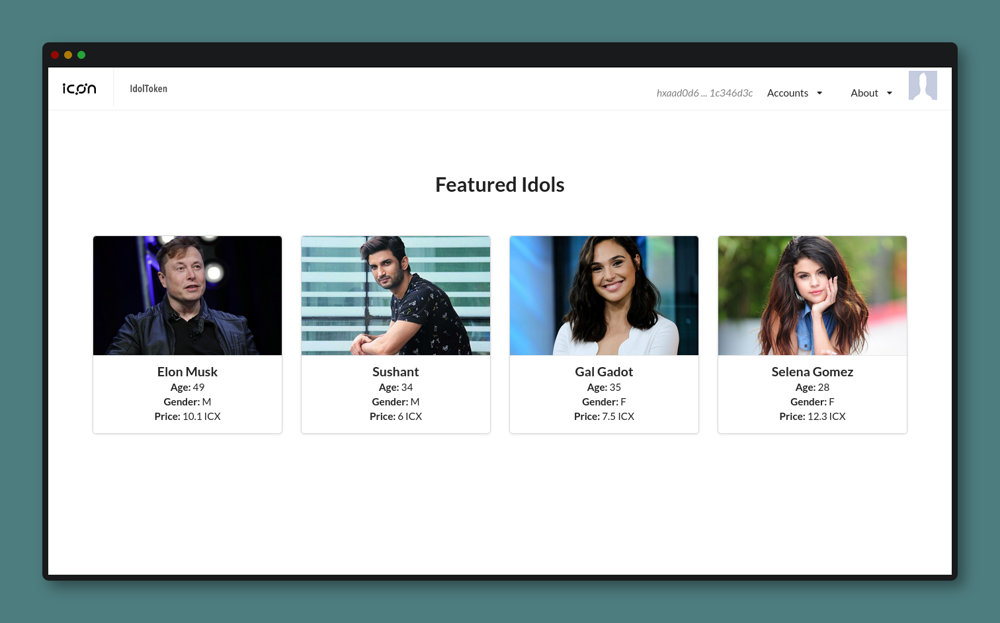

# Try the Idol Token
You can test the Idol Token from [here](https://idoltoken.opendevicon.io).

---

Initially, three address are preloaded. 

`hx829238bc4d7100ca918b2c9c3768edc97de1d375`
`hxaad0d6e403a9f62bcdbe4479a241786c1c346d3c` 
`hx345bebadc9537481e445a721f5618acf0b4a3b2d`

## Create Idol Token
The address `hxaad0d6e403a9f62bcdbe4479a241786c1c346d3c` owns the contract, and so only that account can create new token. To create a token, select that address. Then, open the wallet of that address by clicking the `picture`. It shows you the basic information about the account, and the tokens owned by that account.

Now, click the Create Token[IDOL] button to create a new token. Enter the `name`, `age`, `gender` and load the `image`.Then, upload the image.  The image will be stored in [IPFS](https://ipfs.io/) and it will return a hash. Then, create the token. 

Now, go to the homepage. The new token is created and is owned by `hxaad0d6e403a9f62bcdbe4479a241786c1c346d3c`.

## Transfer Idol Token
To transfer a token to another address, select a token. Click on Transfer button and select the address to which the token is to be transferred and confirm the transfer. To check if the transfer was successful, select the corresponding address and see the tokens owned by that address. 