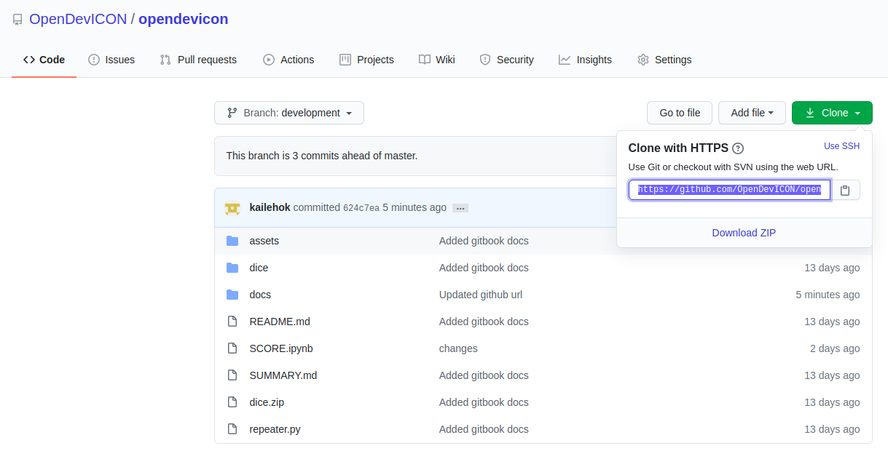
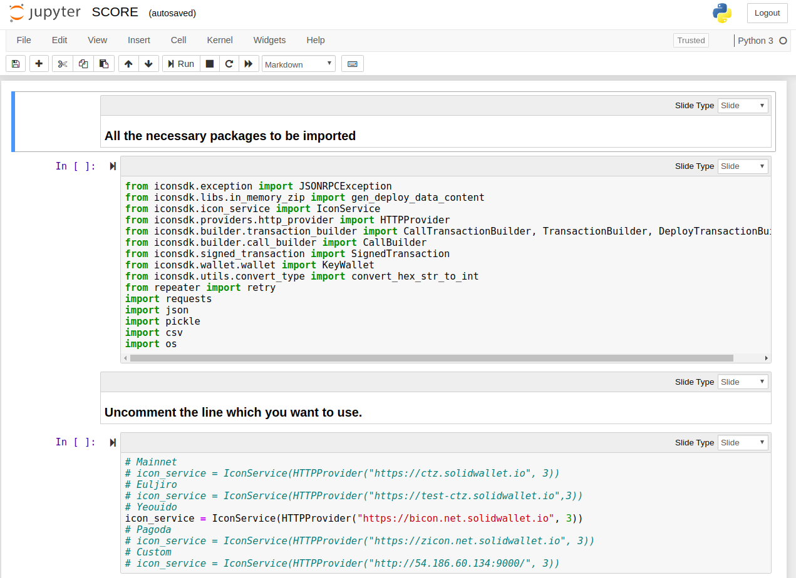

# SCORE Interaction

## Jupyter Notebook for ICON Environment

As a SCORE developer, using tbears for SCORE deploy,update process and making a transaction call is a bit cumbersome. So to make the whole process smooth, SCORE can be handled with a Jupyter Notebook approach where we will be using Python SDK for each operation in different cell.

We have made a [**template**](https://github.com/kailehok/opendevicon/blob/master/SCORE.ipynb) and all you will have to do is update some parameters to the SDK and execute the cell to perform the operation. This makes us get rid of tbears cli commands hassle while interacting with SCORE.

Before proceeding ahead make sure the [**prerequisites**](../../getting-started/prerequisites.md) are already installed.

## Cloning the project

You can get the project repo from [**Github**](https://github.com/kailehok/opendevicon)



Run command:-

```text
$ git clone https://github.com/OpenDevICON/opendevicon.git
```

Open Jupyter Notebook file using command:-

```python
$ cd opendevicon
$ jupyter-notebook
```

Now you can see a Jupyter instance running in your browser


Click on **SCORE.ipnyb** file which will be our main Jupyter Notebook file




If you are new to Jupyter Notebook, read the [**article**](https://www.codecademy.com/articles/how-to-use-jupyter-notebooks) to be familiar with usage of Jupyter Notebook


## Setting up environment

Before we move on to using the SDK we first need to initialize our environment.

### Importing packages

All the necessary packages required for using SDK must be imported.

```python
from iconsdk.exception import JSONRPCException
from iconsdk.libs.in_memory_zip import gen_deploy_data_content
from iconsdk.icon_service import IconService
from iconsdk.providers.http_provider import HTTPProvider
from iconsdk.builder.transaction_builder import CallTransactionBuilder, TransactionBuilder, DeployTransactionBuilder
from iconsdk.builder.call_builder import CallBuilder
from iconsdk.signed_transaction import SignedTransaction
from iconsdk.wallet.wallet import KeyWallet
from iconsdk.utils.convert_type import convert_hex_str_to_int
from repeater import retry
import requests
import json
import pickle
import csv
import os
```


For error msg like `package not found`

Run command:-

```python
$ pip install <package-name>
```


### Setting up URL

Create an **IconService** instance and set a provider. The **HTTPProvider** takes one of the following URL where the server can be found. For this documentation we will be using [**Yeouido**](https://bicon.tracker.solidwallet.io/) tesnet.

```python
# Mainnet
# icon_service = IconService(HTTPProvider("https://ctz.solidwallet.io", 3))
# Euljiro
# icon_service = IconService(HTTPProvider("https://test-ctz.solidwallet.io",3))
# Yeouido
icon_service = IconService(HTTPProvider("https://bicon.net.solidwallet.io", 3))
# Pagoda
# icon_service = IconService(HTTPProvider("https://zicon.net.solidwallet.io", 3))
# Custom
# icon_service = IconService(HTTPProvider("http://54.186.60.134:9000/", 3))
```

### Setting up NID

Netword ID for Yeoido tesnet is 3.

```python
# Mainnet
# NID = 1
# Euljiro Testnet
# NID = 2
# Yeouido Testnet // Tbears
NID = 3
# Pagoda Testnet
# NID = 80
```

### Creating wallets

We will create two wallets, one for deploying SCORE and other for placing bet.

```python
deployer_wallet = KeyWallet.create()
print("address: ", deployer_wallet.get_address())
caller_wallet = KeyWallet.create()
print("address: ", caller_wallet.get_address())
```


Go to [**ibriz-faucet**](https://icon-faucet.ibriz.ai/) to receive test ICXs in your wallets.


Now we are all set to use the SDK in Jupyter Notebook. You can get the official documentation of PythonSDK for ICON [**here**](https://www.icondev.io/docs/python-sdk).

